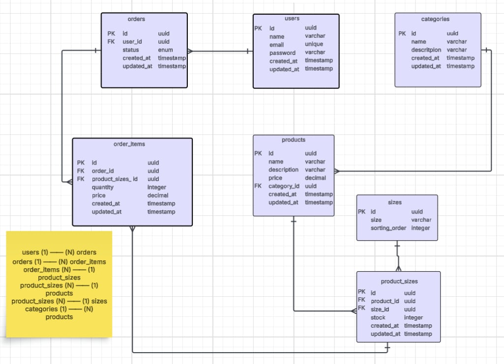

# SOLVD-online-clothing-store
Personal project for the SOLVD Laba Node.js training – Online Clothing Store backend

## Table of Contents
1. [Overview](#overview)
2. [Setup](#setup)
3. [Database Schema](#database-schema)
4. [Entity Relationship Diagram](#entity-relationship-diagram)
5. [API Endpoints](#api-endpoints)
   - [Authentication](#authentication)
     - [Register](#register)
     - [Login](#login)
   - [User Profile](#user-profile)
   - [Products](#products)
6. [Present Limitations](#present-limitations)


## Overview
This project is a **personal project** developed as part of the **SOLVD Laba Node.js training**.

It is a backend API that allows you to manage resources for an online clothing store, including products, categories, and available sizes. Customers can search for clothing items by size and category, and the API returns a list of matching products.

## Setup
- Install [Docker](https://www.docker.com/).  
- Clone this repository.  
- Copy `.env.example` to `.env` and adjust values if needed.
- Run `docker-compose up`.  
- Access the **API** through `http://localhost:3000`.  
- **Database**: available on `localhost:5432` (PostgreSQL)
- In case you want to run tests, you can do so by running `npm run test`.  


## Database Schema
Detailed Table Information

**Users**
| Column      | Type         | Description                      |
| ----------- | ------------ | -------------------------------- |
| id          | UUID (PK)    | Unique identifier of the user    |
| name        | VARCHAR(50)  | Full name of the user            |
| email       | VARCHAR(100) | User’s email (must be unique)    |
| password    | VARCHAR(255) | Hashed password                  |
| created\_at | TIMESTAMP    | When the record was created      |
| updated\_at | TIMESTAMP    | When the record was last updated |


**Categories**
| Column      | Type         | Description                           |
| ----------- | ------------ | ------------------------------------- |
| id          | UUID (PK)    | Unique identifier of the category     |
| name        | VARCHAR(50)  | Category name (e.g., T-Shirts, Shoes) |
| description | VARCHAR(100) | Short description of the category     |
| created\_at | TIMESTAMP    | When the record was created           |
| updated\_at | TIMESTAMP    | When the record was last updated      |


**Products**
| Column       | Type          | Description                         |
| ------------ | ------------- | ----------------------------------- |
| id           | UUID (PK)     | Unique identifier of the product    |
| name         | VARCHAR(100)  | Product name                        |
| description  | VARCHAR(255)  | Optional description of the product |
| price        | DECIMAL(10,2) | Product price                       |
| category\_id | UUID (FK)     | References `categories.id`          |
| created\_at  | TIMESTAMP     | When the record was created         |
| updated\_at  | TIMESTAMP     | When the record was last updated    |


**Sizes**
| Column         | Type        | Description                       |
| -------------- | ----------- | --------------------------------- |
| id             | UUID (PK)   | Unique identifier of the size     |
| size           | VARCHAR(10) | Clothing size (e.g., S, M, L, XL) |
| sorting\_order | INTEGER     | Defines display order for sizes   |


**Product Sizes**
| Column      | Type      | Description                                |
| ----------- | --------- | ------------------------------------------ |
| id          | UUID (PK) | Unique identifier of the product-size pair |
| product\_id | UUID (FK) | References `products.id`                   |
| size\_id    | UUID (FK) | References `sizes.id`                      |
| stock       | INTEGER   | Quantity available in stock                |
| created\_at | TIMESTAMP | When the record was created                |
| updated\_at | TIMESTAMP | When the record was last updated           |


**Orders**
| Column      | Type      | Description                                                          |
| ----------- | --------- | -------------------------------------------------------------------- |
| id          | UUID (PK) | Unique identifier of the order                                       |
| user\_id    | UUID (FK) | References `users.id`                                                |
| status      | ENUM      | Order status: `pending`, `paid`, `shipped`, `delivered`, `cancelled` |
| created\_at | TIMESTAMP | When the record was created                                          |
| updated\_at | TIMESTAMP | When the record was last updated                                     |


**Order Items**

| Column            | Type          | Description                         |
| ----------------- | ------------- | ----------------------------------- |
| id                | UUID (PK)     | Unique identifier of the order item |
| order\_id         | UUID (FK)     | References `orders.id`              |
| product\_size\_id | UUID (FK)     | References `product_sizes.id`       |
| quantity          | INTEGER       | Quantity of the product ordered     |
| price             | DECIMAL(10,2) | Price of the product at order time  |
| created\_at       | TIMESTAMP     | When the record was created         |
| updated\_at       | TIMESTAMP     | When the record was last updated    |


**Relationships Explained**

The relationships between the tables are:

users (1) —— (N) orders
A user can have many orders, each order belongs to one user.

orders (1) —— (N) order_items
An order can have many order items, each item belongs to one order.

order_items (N) —— (1) product_sizes
Each order item refers to one product-size combination, a product-size can appear in many order items.

product_sizes (N) —— (1) products
Each product-size is for one product, a product can have many product-sizes.

product_sizes (N) —— (1) sizes
Each product-size has one size, a size can be used by many product-sizes.

categories (1) —— (N) products
Each category can have many products, a product belongs to one category.


## Entity Relationship Diagram



## API Endpoints
### Authentication

**Authentication Process**

This API uses JWT authentication. The steps for authentication are the following:
Register a new user (optional if you already have an account).
Login with your credentials to receive a JWT token.
Use the token in the Authorization header (Bearer <token>) for all protected endpoints.

#### Register

Send a POST request to /api/auth/register with a JSON body containing the name, email, and password properties.

Request example:
```json
{
  "name": "Dorota",
  "email": "dorota@example.com",
  "password": "password123"
}
```

Response example:
```json
{
  "message": "Registration successful",
  "user": {
    "id": "f47ac10b-58cc-4372-a567-0e02b2c3d479",
    "name": "Dorota",
    "email": "dorota@example.com",
    "created_at": "2025-09-24T12:34:56.000Z"
  }
}
```

Note: The password is hashed before storing in the database.

#### Login

Send a POST request to `api/auth/login` with a JSON body containing the email and password properties.

Request example:
```json
{
  "email": "dorota@example.com",
  "password": "password123"
}
```

Response example:
```json
{
  "message": "Login successful",
  "token": "eyJhbGciOiJIUzI1NiIsInR5cCI6IkpXVCJ9.eyJlbWFpbCI6ImRvcm90YUBleGFtcGxlLmNvbSIsImlhdCI6MTY5NjQyNTI0MH0.DgYg6XYZ..."
}
```

Note: The token field contains your JWT token. Use it in the Authorization header for protected endpoints:
Authorization: Bearer <your-token-here>


### User Profile

This endpoint allows a logged-in user to fetch their profile data. It is protected, so a valid JWT token must be provided.

Endpoint:
GET `api/user/profile`
Request headers:
`Authorization`: Bearer <your_jwt_token>
Body: none

Response
If the token is valid:
```json
{
    "message": "Protected data",
    "user": {
        "userId": "c822a9f7-bf15-489a-a6bf-4551b6d2b238",
        "email": "dorota@example.com"
    }
}
```

### Products

After login, you can:
- Search for clothing items by size (S, M, L, XL, XXL)
- Filter products by category (e.g., T-Shirt, Hoodie, Shoes)
- Search by product name (partial matches supported)
- Only see products that are in stock

**Fetch Products by Size**

You can filter products by size using the size query parameter. Only products with available stock (stock > 0) in the requested size will be returned.

Endpoint
GET `/api/products?size=S`

Request headers:
`Authorization`: Bearer <your_jwt_token>

Response Example
```json
[
    {
        "id": "7408ce76-392e-4186-ab0c-9d3f5b9c2a8b",
        "name": "Basic T-Shirt",
        "description": "Cotton T-Shirt",
        "price": "15.99",
        "category": "T-Shirts",
        "stock": 50,
        "size": "S"
    },
    {
        "id": "941127da-ba81-441f-903c-6ef45d47bcd9",
        "name": "Blue Jeans",
        "description": "Slim fit jeans",
        "price": "49.99",
        "category": "Jeans",
        "stock": 30,
        "size": "S"
    },
    {
        "id": "819bddce-7a3c-4fd6-b18f-4ed47a341f78",
        "name": "Cozy Hoodie",
        "description": "Warm cotton hoodie",
        "price": "35.99",
        "category": "Hoodies",
        "stock": 40,
        "size": "S"
    },
    {
        "id": "68b678ac-6f9e-4a56-8df6-8dcbf8336465",
        "name": "Summer Dress",
        "description": "Light summer dress",
        "price": "29.99",
        "category": "Dresses",
        "stock": 25,
        "size": "S"
    }
]
```

**Fetch Products with Multiple Filters**
You can combine `size`, `category`, and `name` query parameters to narrow down results.

Endpoint:
GET `/api/products?size=M&category=T-Shirts&name=shirt`

Request headers:
`Authorization`: Bearer <your_jwt_token>

Response example:
```json
[
    {
        "id": "7408ce76-392e-4186-ab0c-9d3f5b9c2a8b",
        "name": "Basic T-Shirt",
        "description": "Cotton T-Shirt",
        "price": "15.99",
        "category": "T-Shirts",
        "stock": 50,
        "size": "M"
    }
]
```

## Present limitations:

- The API is not deployed yet, so it must be run locally.

- Management of products (adding, editing, and deleting) is a planned feature and will be implemented in future steps.